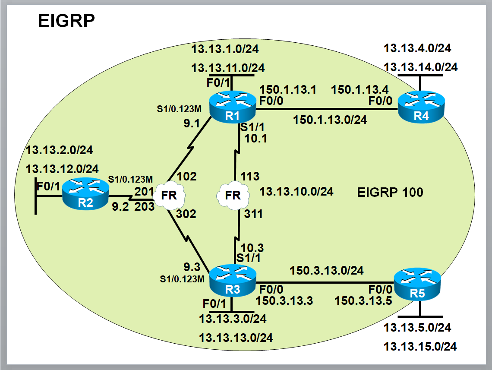

# EIGRP-Route-Filtering-Study

> EIGRP 환경에서 다양한 경로 필터링(Route Filtering) 기법을 학습하고 실습한 내용을 정리한 저장소입니다.

---

## 📌 Overview

본 저장소는 Cisco 라우터에서 EIGRP 라우팅 프로토콜을 기반으로 한 **경로 필터링(Route Filtering)** 기술을 정리한 학습 자료입니다.  
Frame-Relay 기반의 5개 라우터(R1~R5) 토폴로지에서 ACL, Prefix-list, Route-map, Distribute-list, Tagging, Offset-list 등 다양한 필터링 기법을 실습합니다.

---

## 📚 Chapters (목차)

| # | 챕터 | 설명 |
|---|------|------|
| 01 | [EIGRP 기본 구성](./01_EIGRP_Basic.md) | AS 100, Passive-interface, Frame-Relay 환경 기본 설정 |
| 02 | [EIGRP Timer 조정](./02_EIGRP_Timer.md) | Hello/Hold-time 변경 (5/15초) |
| 03 | [Prefix-list](./03_Prefix-list.md) | Prefix-list 기본 형식 및 ge/le 옵션 활용 |
| 04 | [Route-map](./04_Route-map.md) | Match/Set 구문 기반 트래픽 필터링 및 속성 변경 |
| 05 | [Distribute-list](./05_Distribute-list.md) | ACL / Prefix-list / Route-map 기반 라우팅 업데이트 필터링 |
| 06 | [Tagging](./06_Tagging.md) | 라우팅 정보에 Tag 부여 및 Tag 기반 필터링 |
| 07 | [Offset-list](./07_Offset-list.md) | Metric 조정을 통한 경로 변경 |
| 08 | [Bogon Filter](./08_Bogon_Filter.md) | 인터넷에 나타나면 안 되는 대역 차단 |
| 09 | [종합 실습 문제](./09_Practice.md) | R1~R5 종합 필터링 시나리오 |
| 99 | [Full Config](./99_Full_Config.md) | R1 ~ R5 전체 초기 구성 |

---

## 🖥️ Topology

---

## 🧪 Lab 환경

- **Routing Protocol**: EIGRP AS 100
- **WAN**: Frame-Relay (R1-R2-R3 multipoint, R1-R3 point)
- **LAN**: FastEthernet
- **Auto-summary**: Disabled
- **Filtering Targets**: 사설망(RFC1918), Bogon, Tag 기반 등

---

## 🔧 주요 필터링 기법 요약

| 기법 | 용도 | 설정 위치 |
|------|------|-----------|
| **ACL** | 네트워크 범위 지정 (가장 기본) | `access-list` |
| **Prefix-list** | ACL로 표현 불가능한 정밀한 범위 지정 (`ge`, `le`) | `ip prefix-list` |
| **Route-map** | Match/Set 조합으로 트래픽 필터링 + 속성 변경 | `route-map` |
| **Distribute-list** | 라우팅 업데이트 송/수신 필터링 | `router eigrp` |
| **Tagging** | 경로에 Tag 부여 후 Tag로 필터링 | `route-map` + `set tag` |
| **Offset-list** | Metric 증가로 최적 경로 변경 | `router eigrp` |

---

## 📖 참고

- 본 자료는 CCNP / CCIE 라우팅 학습을 위한 실습 노트입니다.
- 모든 명령어는 Cisco IOS 기준입니다.

---

## 📜 License

This repository is for educational purposes.
